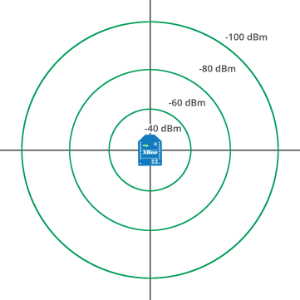
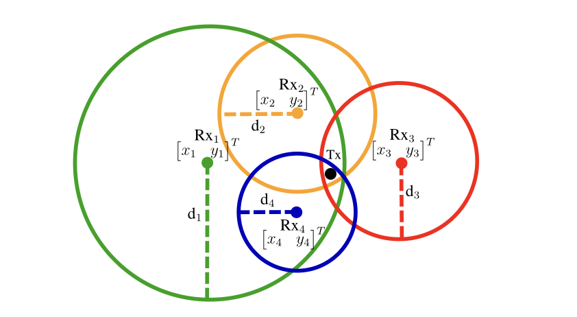
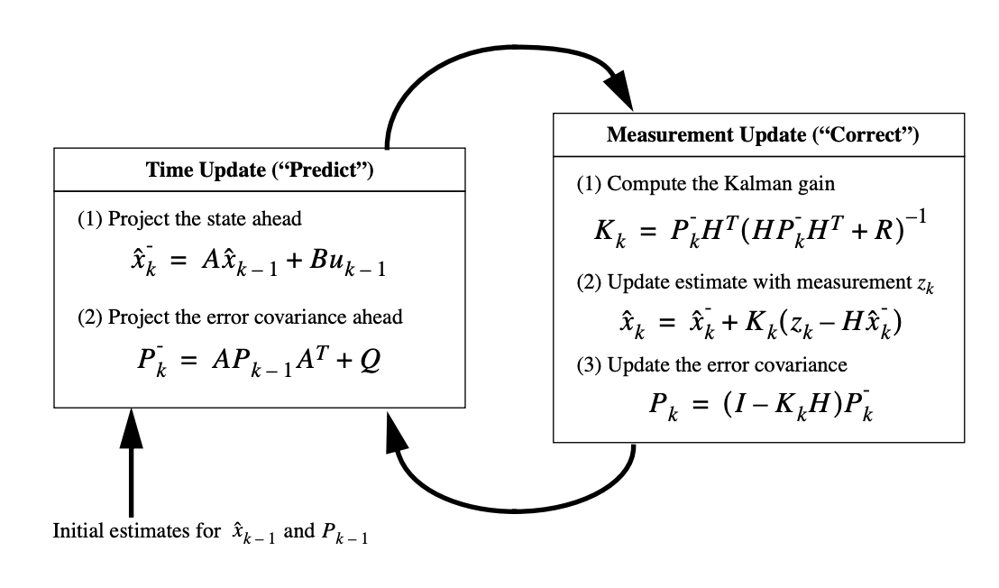
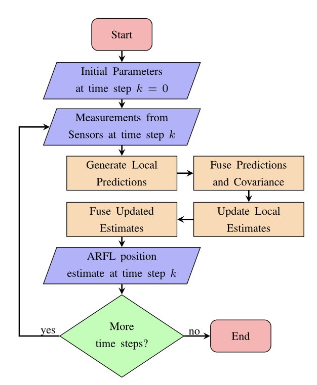
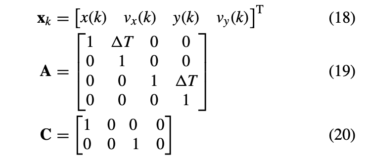

# LocationDeterminationPrototype

### HOW to run and test websockets

+ terminal 1:

```
   uvicorn api.main:app --host 0.0.0.0 --port 8000 --reload
```

+ terminal 2:

```
   python -m tests.test_websockets     
```

```
   python -m tests.test_websockets_high      
```

### **Option 2: Distance → Log → Trilateration → Kalman (4-state)**

1. **Distance log**: Convert RSSI → distance.
2. **Trilateration**: Compute raw (X, Y) positions from distances.
3. **Kalman filter**: Use a **4-state KF**:

   * **State vector**: `[X, Y, Vx, Vy]`
   * **Dynamics**: Models both **position and velocity**.
   * KF smooths both position and velocity estimates.

**Pros:**

* Models actual **movement of the target**, not just measurement noise.
* Can predict future positions if you implement a **constant velocity or acceleration model**.
* More consistent for real-time tracking in dynamic environments.

**Cons:**

* Trilateration errors can propagate into the KF as noisy measurements.
* Requires careful tuning of **process noise Q** and **measurement noise R** for good performance.

---

### **Practical Recommendation**

For most IPS systems, **Option 2 (Trilateration → 4-state KF)** is more robust:

* It naturally integrates **motion dynamics**.
* The KF can correct noisy trilateration measurements while predicting smooth trajectories.
* Especially useful if the user/device moves and you want velocity estimates.

**State Transition Example (Discrete Constant Velocity Model)**:

$$
\mathbf{x}_k = 
\begin{bmatrix} X \\ Y \\ V_x \\ V_y \end{bmatrix}_k
, \quad
\mathbf{F} =
\begin{bmatrix}
1 & 0 & \Delta t & 0 \\
0 & 1 & 0 & \Delta t \\
0 & 0 & 1 & 0 \\
0 & 0 & 0 & 1
\end{bmatrix}
$$

$$
\mathbf{z}_k = 
\begin{bmatrix} X_{\text{meas}} \\ Y_{\text{meas}} \end{bmatrix}_k
, \quad
\mathbf{H} =
\begin{bmatrix} 1 & 0 & 0 & 0 \\ 0 & 1 & 0 & 0 \end{bmatrix}
$$

* `X_meas` and `Y_meas` come from trilateration of distances.
* The KF will estimate `X, Y, Vx, Vy` optimally considering **measurement noise** and **process noise**.


## pipline


## RSSI values



## Multilateration


## Kalman Filtering


## Flow chart

Kalman Filter = Prediction + Correction loop
Predict what you think is true → based on physics or previous data.
Measure what sensors tell you now.
Update your prediction using those measurements.
Repeat again and again.



## kalman state Variables 

+ where vx(k) and vy(k) represent, respectively, the velocities
(m/s) in coordinates x(k) and y(k) at time step k, and T is
the sampling time.
